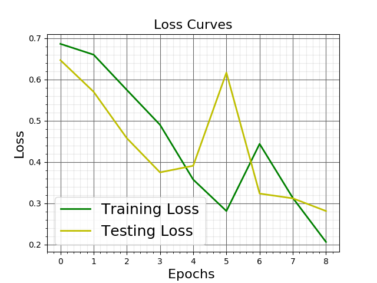

# Install WFDB Software Package
     Follow instructions in: https://physionet.org/physiotools/wfdb-linux-quick-start.shtml 

# Install requirements
    > pip install -r requirements.txt

# Download Dataset
    > wget -r -np http://www.physionet.org/physiobank/database/afpdb/

# Copy paste afpdb folder to current directory 
    > mv www.physionet.org/physiobank/database/afpdb .

# Create CSV files 
    > python dat2csv.py

# Create training and test dataset
    > mkdir training test

# Split manually dataset (afpdbCSV) to training and test:
    * My dataset has 180 training samples (90 normal + 90 abnormal) and   20 testing samples (10 normal + 10 abnormal)
        n**.csv: Normal Patient  
        p**.csv  Abnoramal Patient 

# Create .npy files 
    >  python create_dataset.py

# Create Neural Network model and train it 
    > python train.py

# Rename the best model from my_model.h5 to best.h5
     

# Make predictions with best model (90% accuracy)
    > python predict.py
# Tensoarboard
    > tensorboard --logdir=logs/

# Normal Record

# Abnormal Record

